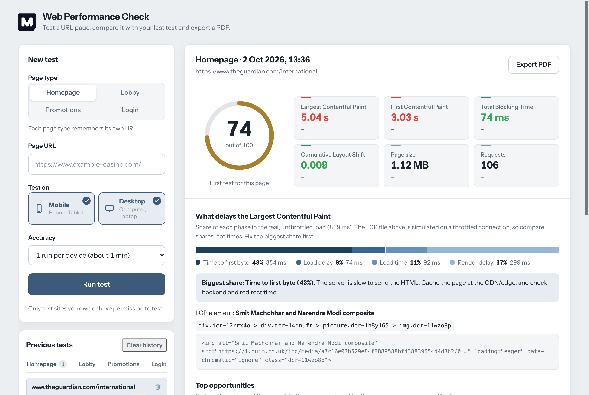
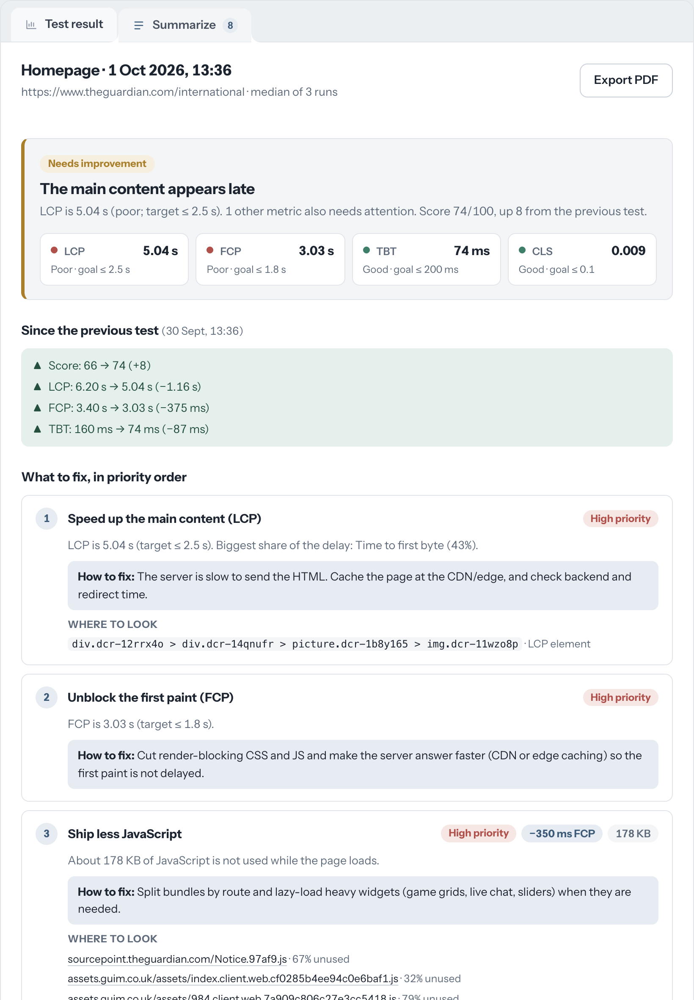
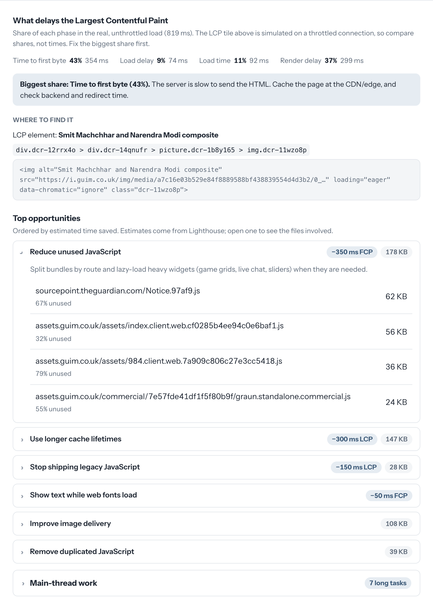
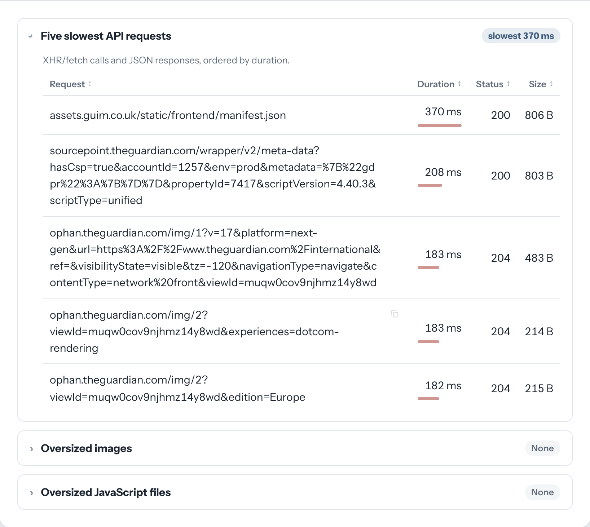

# Casino Performance Check

A small, self-hosted web tool (Next.js + Lighthouse) that measures how fast casino pages load — homepage, lobby, promotions and login — and explains **why** a page is slow and **what to fix first**. Each test is saved in your browser, compared with the previous one, and can be exported as a PDF report.



## Requirements

- **Node.js 22.19 or later** (required by Lighthouse 13).
- **Google Chrome or Chromium** installed on the machine running the server. Lighthouse drives it in headless mode.
  If it is not detected automatically, point to it with `CHROME_PATH`:
  ```bash
  CHROME_PATH="/path/to/chrome" npm run dev
  ```

## Getting started

```bash
npm install
npm run dev          # http://localhost:3000
```

Production build:

```bash
npm run build
npm start
```

Tests (Vitest, no Chrome needed — they run against a trimmed real Lighthouse report in `lib/__fixtures__/`):

```bash
npm test             # or npm run test:watch
```

### Running a test

1. Choose the **page type** (Homepage, Lobby, Promotions or Login). Each type remembers its last URL.
2. Paste the **page URL**.
3. Select **Mobile**, **Desktop** or both.
4. Choose the **accuracy**: 1 run per device (about 1 min), or 3 runs and keep the median (more stable).
5. Click **Run test**. Tests run one at a time; the app shows your position in the queue, the estimated time left, and lets you cancel.

> Only test sites you own or have permission to test.

## What you get

Results open in two browser-style tabs: **Test result** (the full detail, below) and **Summarize** (everything that was found, boiled down to what to fix first).

### Summarize tab


One card per device that gathers the whole test, so you do not have to look in several places:

- **Verdict:** a one-line diagnosis ("The main content appears late"), the score, and the four Core Web Vitals with their rating and goal.
- **Since the previous test:** which metrics got worse or better, with a reminder that single-run results can swing.
- **What to fix, in priority order:** each suggestion has the evidence from this test, a concrete **How to fix** tip and **Where to look** (the files or the LCP element). Metrics outside their goal come first, then Lighthouse opportunities by estimated time saved. Image and JavaScript findings are merged so nothing is listed twice; the first six are shown and the rest expand on demand.
- **What is working:** the metrics and checks that are already fine.

Tests saved before the diagnosis existed still get a summary, built from the data they have.

### Headline metrics
Performance score (0–100) and the main Lighthouse metrics: **LCP, FCP, TBT, CLS**, page weight and number of requests. Values are colored green / yellow / red using Google's thresholds, and each one shows the change since the previous test of the same URL, page type and device.

### Diagnosis — why the page is slow


- **What delays the Largest Contentful Paint:** the LCP time split into its four phases (time to first byte, load delay, load time, render delay), with a concrete tip for the biggest one. It also shows the LCP element, its CSS selector (copyable) and its HTML snippet.
- **Top opportunities:** Lighthouse audits that failed (unused JavaScript, image delivery, cache lifetimes, legacy JavaScript, fonts…), sorted by estimated time saved. Each one has a practical tip and expands to list the files involved and why.
- **Render-blocking requests:** CSS and JS that delay the first paint.
- **Main-thread work:** long tasks and CPU time per script, which explain a high TBT.

### Findings


Collapsible sections with a one-line summary, sortable columns and a button to copy each full URL:

- **Five slowest API requests** (XHR/fetch, JSON responses, `/api` and `/graphql` routes).
- **Oversized images** (> 200 KB) with a thumbnail preview, a link that opens the image in a new tab, the reason Lighthouse flags it, and the estimated savings.
- **Oversized JavaScript files** (> 150 KB) with how much of each file goes unused on load.

### History and reports
- Every test is saved in the browser (`localStorage`, key `casino-perf:tests`, last 100 tests), grouped in tabs by page type. You can delete a single test or clear the whole history.
- **Export PDF** creates a report with the metrics, the comparison with the previous test, the diagnosis and the findings for each device.

## Configuration

Thresholds and page types live in [`lib/config.ts`](lib/config.ts):

- `THRESHOLDS`: what counts as an oversized image or script, a slow API call (`slowApiMs`, `verySlowApiMs`) or a heavy page (`pageBytes`, `veryHeavyPageBytes`). The API and page-weight limits only drive the Summarize tab.
- `PRIORITY_THRESHOLDS`: how Lighthouse's estimated savings map to High / Medium / Low priority in the Summarize tab.
- `RATINGS`: the good / poor limits used for colors.
- `LCP_PHASES` and `OPPORTUNITIES`: the tips shown in the diagnosis. Edit them to match your stack.
- `PAGE_TYPES` and `DEVICES`: the page types and devices offered in the form.

## Project structure

Code follows the team standards in [`docs/ESTANDARES_DE_CODIGO.md`](docs/ESTANDARES_DE_CODIGO.md); custom React hooks are grouped in `app/hooks/`, and each `lib/` module lives with its test.

```
app/page.jsx                 Server Component: static header + <Workspace />
app/components/
  ui/                        shared building blocks: Icon, Badge, CopyButton, Tabs, Accordion
  Workspace/                 the interactive part ('use client'): form, progress, results and history
  TestForm/                  new-test form
  Results/                   results panel: DeviceResult, Diagnosis, DataTable
  Summary/                   Summarize tab: verdict, prioritized fixes
  History/                   saved tests, one tab per page type
app/hooks/                   custom hooks: useTestJob (run, poll, cancel), useHistory, useRememberedUrls,
                             useSortedRows, useExportPdf, useCopyToClipboard, useArrowKeyTabs
app/api/test                 POST: queue a test · GET/DELETE /api/test/[id]: status / cancel
app/api/report               POST: build the PDF report
lib/lighthouse.ts            runs Lighthouse in headless Chrome
lib/analyze.ts               Lighthouse report → metrics, diagnosis and findings (pure)
lib/summarize.ts             Summarize tab: verdict, prioritized fixes and what works (pure)
lib/queue.ts + estimate.ts   in-memory queue (one test at a time); ETA and position math (pure)
lib/storage.ts               history and remembered URLs in localStorage (all keys prefixed casino-perf:)
lib/compare.ts               better / worse rules against the previous test
lib/pdf.ts                   PDF report (pdfkit)
lib/format.ts · cn.ts        shared text formatters · conditional class names
lib/tokens.ts                design tokens shared with app/globals.css (a test keeps them in sync)
lib/config.ts                thresholds, page types, devices and tips
```

$